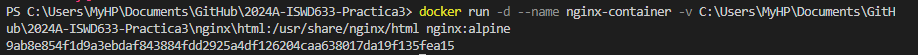
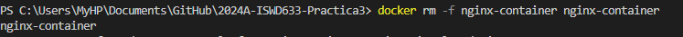

# VOLUMEN TIPO HOST
Un volumen host (o bind mount) es un tipo de volumen donde se monta un directorio o archivo específico del sistema de archivos del host en un contenedor.

```
docker run -d --name <nombre contenedor> -v <ruta carpeta host>:<ruta carpeta contenedor> <imagen> 
```

### Crear un volumen tipo host con la imagen nginx:alpine, mapear todos por puertos, para la ruta carpeta host: directorio en donde se encuentra la carpeta html en tu computador y para la ruta carpeta contenedor: /usr/share/nginx/html esta ruta se obtiene al revisar la documentación

# COMPLETAR CON EL COMANDO

### ¿Qué sucede al ingresar al servidor de nginx?
# COMPLETAR CON LA RESPUESTA A LA PREGUNTA
Al acceder al servidor nginx, se mostrará el contenido del directorio que se ha montado desde el host. Esto implica que cualquier archivo HTML o recursos estáticos (CSS, JS, imágenes) en la carpeta html del host serán proporcionados por nginx.

### ¿Qué pasa con el archivo index.html del contenedor?
# COMPLETAR CON LA RESPUESTA A LA PREGUNTA
El archivo index.html en el contenedor será sustituido por el index.html del directorio montado desde el host. Si el directorio del host no tiene un archivo index.html, nginx mostrará un error 403 (Forbidden) o 404 (Not Found), según la configuración.

### Ir a https://html5up.net/ y descargar un template gratuito, descomprirlo dentro de nginx/html
### ¿Qué sucede al ingresar al servidor de nginx?
# COMPLETAR CON LA RESPUESTA A LA PREGUNTA
Al ingresar al servidor de nginx, se verá el nuevo template HTML que has descargado y descomprimido en la carpeta html del host. Nginx servirá este contenido actualizado.
### Eliminar el contenedor
# COMPLETAR CON EL COMANDO

### ¿Qué sucede al crear nuevamente el mismo contenedor con volumen de tipo host a los directorios definidos anteriormente?
# COMPLETAR CON LA RESPUESTA A LA PREGUNTA
Al recrear el mismo contenedor con el volumen de tipo host apuntando a los mismos directorios definidos, el contenido del contenedor nginx será idéntico al contenido del directorio del host. Esto implica que nginx servirá el contenido actualizado del directorio html del host.
### ¿Qué hace el comando pwd?
# COMPLETAR CON LA RESPUESTA A LA PREGUNTA

El comando pwd (print working directory) muestra la ruta completa del directorio actual en el que te encuentras. En el contexto de Docker, se puede usar para obtener la ruta actual de trabajo y montar directorios correctamente.


Si quieres incluir el comando pwd dentro de un comando de Docker, lo puedes hacer de diferentes maneras dependiendo del shell que estés utilizando.


### Volumen tipo host usando PWD y PowerShell
```
docker run -d --name <nombre contenedor> --publish published=<valorPuertoHost>,target=<valor> -v ${PWD}/<ruta relativa>:<ruta absoluta> <nombre imagen>:<tag> 
```

### Volumen tipo host usando PWD (Git Bash)

```
docker run -d --name <nombre contenedor> --publish published=<valorPuertoHost>,target=<valor> -v $(pwd -W)/html:/usr/share/nginx/html <nombre imagen>:<tag> 
```

### Volumen tipo host usando PWD (en Linux)

```
docker run -d --name <nombre contenedor> --publish published=<valorPuertoHost>,target=<valor> -v $(pwd)/html:/usr/share/nginx/html <nombre imagen>:<tag> 
```

