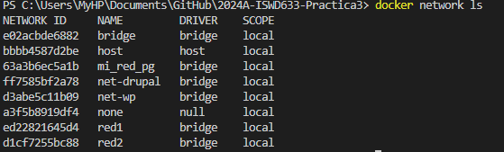
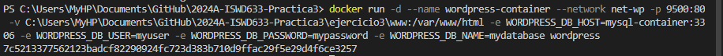

## Esquema para el ejercicio

### Crear red net-wp
# COMPLETAR CON EL COMANDO COMANDO

### Para que persista la información es necesario conocer en dónde mysql almacena la información.
# COMPLETAR LA SIGUIENTE ORACIÓN. REVISAR LA DOCUMENTACIÓN DE LA IMAGEN EN https://hub.docker.com/)
En el esquema del ejercicio la carpeta contenedor (a) es (C/var/lib/mysql) Ruta carpeta host: .../ejercicio3/db

### ¿Qué contiene la carpeta db del host?
La carpeta db del host contiene los archivos de datos de MySQL, incluyendo bases de datos, tablas y registros.

### Crear un contenedor con la imagen mysql:8  en la red net-wp, configurar las variables de entorno: MYSQL_ROOT_PASSWORD, MYSQL_DATABASE, MYSQL_USER y MYSQL_PASSWORD
# COMPLETAR CON EL COMANDO

### ¿Qué observa en la carpeta db que se encontraba inicialmente vacía?
# COMPLETAR CON LA RESPUESTA A LA PREGUNTA
Se observa que ahora la carpeta contiene varios archivos y directorios, que corresponden a las bases de datos y otros datos utilizados por MySQL.

### Para que persista la información es necesario conocer en dónde wordpress almacena la información.
# COMPLETAR LA SIGUIENTE ORACIÓN. REVISAR LA DOCUMENTACIÓN DE LA IMAGEN EN https://hub.docker.com/
En el esquema del ejercicio la carpeta contenedor (b) es (COMPLETAR CON LA RUTA) Ruta carpeta host: .../ejercicio3/www

### Crear un contenedor con la imagen wordpress en la red net-wp, configurar las variables de entorno WORDPRESS_DB_HOST, WORDPRESS_DB_USER, WORDPRESS_DB_PASSWORD y WORDPRESS_DB_NAME (los valores de estas variables corresponden a los del contenedor creado previamente)
# COMPLETAR CON EL COMANDO

### Personalizar la apariencia de wordpress y agregar una entrada

### Eliminar el contenedor y crearlo nuevamente, ¿qué ha sucedido?

# COMPLETAR CON LA RESPUESTA A LA PREGUNTA
Al eliminar el contenedor y crearlo nuevamente, las personalizaciones y entradas previamente realizadas persisten. Esto se debe a que los datos de WordPress y MySQL se almacenan en volúmenes montados desde el host, garantizando que la información no se pierda con la eliminación de los contenedores.

